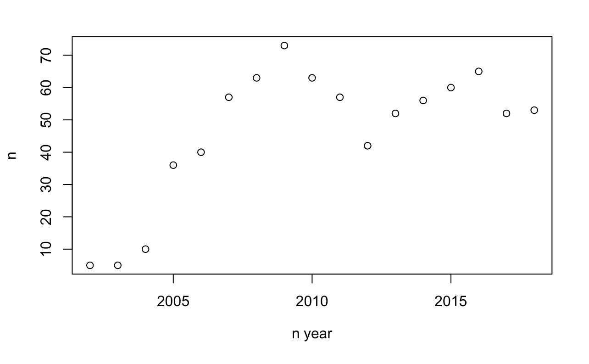
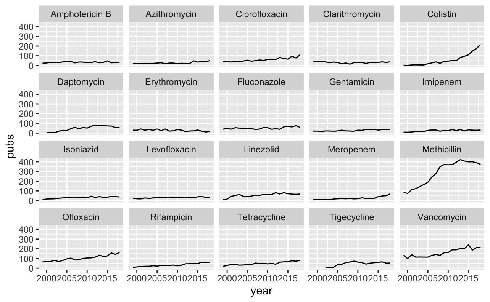
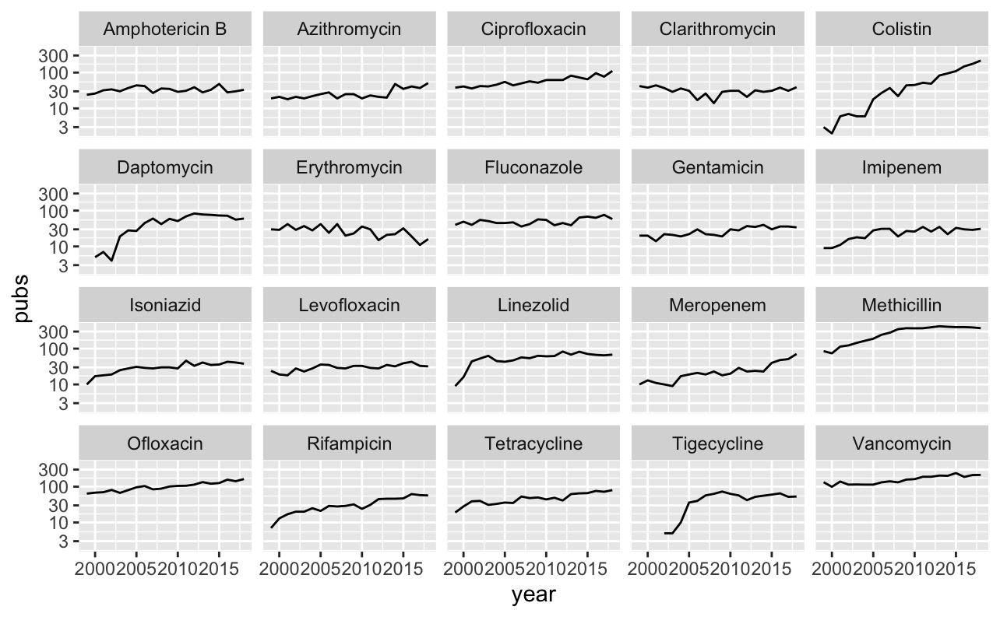
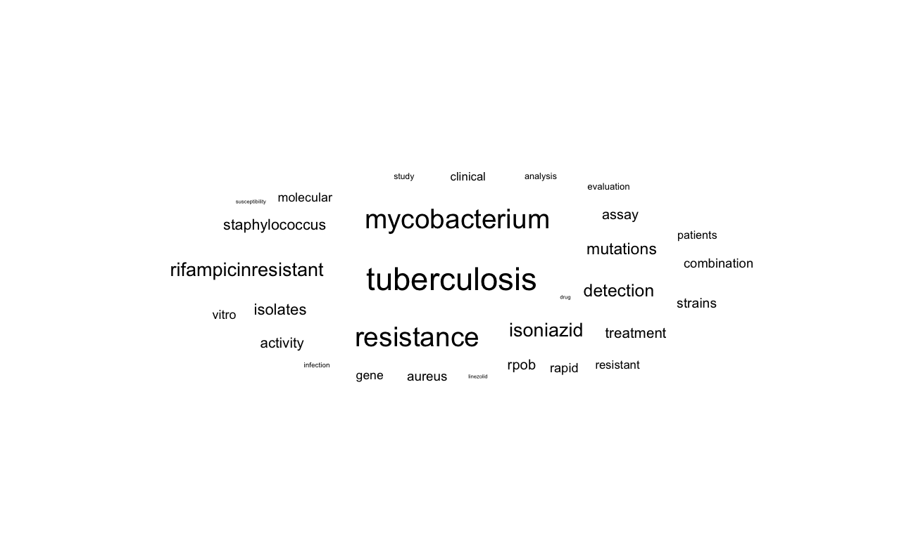
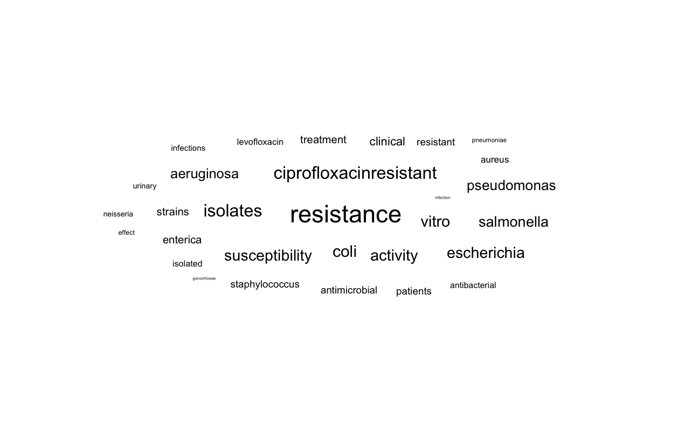

## Introduction 
Publication trends can be used as a surrogate to guage the changing interests of the medical community in certain subjects. This approach has been used by [Luz et al](https://www.biorxiv.org/content/10.1101/2021.03.01.433375v1) to show changes in antimicrobial resistance research between 1999 and 2018.

Similarly, trends in individual antimicrobial publications could perhaps give insight into the "popularity" of certain agents. We'll use the data from the above study to look into this further. 

## Data prep 
Conveniently the [data](https://osf.io/j3d65/) from the above study has been made available for download. The file 'data_osf.csv' contains details of studies between 1999-2018 related to antimicrobials and AMR, pulled from pubmed. Once this is downloaded, we'll load it into R. I'll load the tidyverse package, and the [AMR](https://msberends.github.io/AMR/) package, which will simplify some things later on. Firstly let's have a look at the data using glimpse(). 

```R
library(tidyverse)
library(AMR)
data <- read_csv('data_osf.csv')
data <- data %>% rename("study_group" = "name")
glimpse(data, width = 60)
```

```
## Rows: 158,616
## Columns: 10
## $ pmid        <dbl> 10614508, 10614958, 10614950, 10614949…
## $ year        <dbl> 1999, 1999, 1999, 1999, 1999, 1999, 19…
## $ title       <chr> "Cytokine therapy: a natural alternati…
## $ abstract    <chr> "Disease control in food production an…
## $ journal     <chr> "Veterinary immunology and immunopatho…
## $ topic       <dbl> 1, 60, 22, 21, 10, 20, 20, 79, 70, 21,…
## $ study_group <chr> "Strategies for emerging resistances a…
## $ theme       <chr> "strategy", "clinical", "organism", "s…
## $ country     <chr> "Australia", "Spain", "Spain", "Nether…
## $ who_region  <chr> "WHO Western Pacific Region", "WHO Eur…
```

The main fields of interest to us are the year of publication, title and abstract. I have renamed the name column to study_group to avoid confusion (this column describes what type of a study the item is). 

## Visualising trends
Let's try looking at an particular antimicrobial agent and look at publications over time. I have picked linezolid. We'll filter out studies with "linezolid" in the title, then count these and plot by year for a rough idea. 

```R
data %>% filter(
  str_detect(
    data$title, 
    fixed('tigecycline', ignore_case = T))) %>% 
  group_by(year) %>% 
  summarise(n = n()) %>% 
  plot(n ~ year)
```



Tigecycline was approved around 2005. The number of publications reflect this, with a sustained interest in the antibiotic since around 2005. Our next step is to repeat this step for every possible antibiotic. Firstly we need a list of all antibiotics, which is coveniently in one of the AMR package datasets: 

```R
AMR::antibiotics$name %>% head %>% print
```

```
## [1] "4-aminosalicylic acid" "5-fluorocytosine"      "Acetylmidecamycin"    
## [4] "Acetylspiramycin"      "Aldesulfone sodium"    "Amikacin"
```

```R
AMR::antibiotics$name %>% length %>% print
```

```
## [1] 456
```

We've got 456 agents listed here. Next we'll need to expand the dataframe with information about whether each agent is detected in the title text. This can get a bit messy because a publication can have multiple (or none) agents. I'm sure there must be a more elegant way to do this (please comment below!) but I have gone for a brute additional boolean column for each agent using a for-loop. 

```R
for(i in AMR::antibiotics$name){
  out <- str_detect(data$title, fixed(i, ignore_case = T))
  out <- list(out)
  names(out) <- i
  data <- bind_cols(data, out)
```
}

Now for each agent we have a boolean column telling us whether the agent was detected in the title. This is computationally slow, but once we have the data we can pivot into a longer layout for further analysis. 

```R
data_long <- data %>%
  pivot_longer(cols = AMR::antibiotics$name, names_to = "antibiotic")
```

We now have a dataframe with a row for each antibiotic for each study with a logical value of whether the antibiotic was detected. This will allow us to easily analyse the data. Many of these agents are very obscure, so let's start by getting a list of the top 20 antibiotics (by publications). 

```R
top_20_abx <- data_long %>%
  group_by(antibiotic) %>%
  filter(value == TRUE) %>% 
  summarise(n = n()) %>% 
  arrange(desc(n)) %>% 
  slice_head(n = 20) %>% pull(antibiotic)
print(top_20_abx)
```

```
##  [1] "Methicillin"    "Vancomycin"     "Ofloxacin"      "Ciprofloxacin" 
##  [5] "Colistin"       "Linezolid"      "Fluconazole"    "Tetracycline"  
##  [9] "Daptomycin"     "Tigecycline"    "Amphotericin B" "Rifampicin"    
## [13] "Clarithromycin" "Isoniazid"      "Levofloxacin"   "Erythromycin"  
## [17] "Azithromycin"   "Gentamicin"     "Meropenem"      "Imipenem"
```

These are all recognisable agents - no major suprises here. We can now use this data to plot trends in publications for individual agents over time. 

```R
data_long %>% 
  filter(antibiotic %in% top_20_abx) %>% 
  filter(value == TRUE) %>% 
  group_by(antibiotic, year) %>% 
  summarise(pubs = n()) %>% 
  ggplot(aes(x = year, y = pubs)) +
  geom_line() +
  facet_wrap(~ antibiotic)
```



Two antibiotics stand out. Publications on colistin have been steadily increasing over the past ~10 years. This is not surprising and reflects the emergence of carbapenem-resistant bacteria, which has reignited interest in this old antibiotic. I imagine that interest will plateau over the next few years, reflecting the release of alternative agents with activity against carbapenem-resistant bacteria. 

Another old agent which appears to have re-emerged (and plateaued) is methicillin. This probably reflects interest in MRSA rather than the agent itself. We may get a better idea of trends by log scaling the y-axis. 

```R
data_long %>% 
  filter(antibiotic %in% top_20_abx) %>% 
  filter(value == TRUE) %>% 
  group_by(antibiotic, year) %>% 
  summarise(pubs = n()) %>% 
  ggplot(aes(x = year, y = pubs)) +
  geom_line() +
  facet_wrap(~ antibiotic) +
  scale_y_log10()
```



Most trends are quite stable. Antimicrobials released within the observed time frame reveal quite an interesting trend - publications peak relatively quickly and are then quite stable. Some other trends are also interesting, such as a steady increase in rifampicin. The slope of this is quite similar to isoniazid. This suggests that most of these publications are related to TB. A (not too scientific way) to visualise this could be a word cloud. 

## Word Clouds 

Without going into too much detail on how to create a word cloud, at a high level we need to: 

* clean up the title text (remove punctuation and stop words such as "at", "by", etc)
* create a matrix of each word vs frequency detected in text
* generate a word cloud using an R package such as wordcloud2

The code is below (wrapped in a convenience function to allow changing of antibiotic). 

```R
make_wordcloud <- function(x, abx){
  require(tidyverse)
  require(tm)
  require(ggwordcloud)
  if(!abx %in% AMR::antibiotics$name) stop('Invalid abx')
  words <- x %>% 
    subset(antibiotic == {{abx}}) %>% 
    subset(value == TRUE) %>% pull(title) %>% 
    VectorSource() %>% 
    Corpus %>% 
    tm_map(removePunctuation) %>% 
    tm_map(removeNumbers) %>% 
    tm_map(stripWhitespace) %>% 
    tm_map(content_transformer(tolower)) %>% 
    tm_map(removeWords, stopwords('en')) %>% 
    TermDocumentMatrix() %>% 
    as.matrix()
  words <- sort(rowSums(words), decreasing = T)
  words <- data.frame(word = names(words), freq = words)
  words <- words %>% filter(word != tolower({{abx}}))
  words <- slice_head(words, n = 30)
  ggplot(words, aes(label = word, size = freq)) +
  geom_text_wordcloud() +
  theme_minimal()
}

make_wordcloud(data_long, 'Rifampicin')
```



Indeed the word cloud tilts towards TB terms (tuberculosis, mycobacterium, isoniazid). If we compar this to ciprofloxacin, for example, the results are different. Here we mainly see "salmonella", "pseudomonas", "escherichia". 

```R
make_wordcloud(data_long, 'Ciprofloxacin')
```



## Conclusion

Publication trends seem to reveal changes in academic interest for certain antibiotics. The results suggest also appear to reflect growing concern on certain AMR pathogens such as Cabapenem Resistant Enterobacteraceae, MDRTB, MRSA, etc. Relatively novel antimicrobials released within the data period appear to reach peak interest and plataeu quite quickly. If you have any ideas on what else could be looked at using this data, please do post below. 
